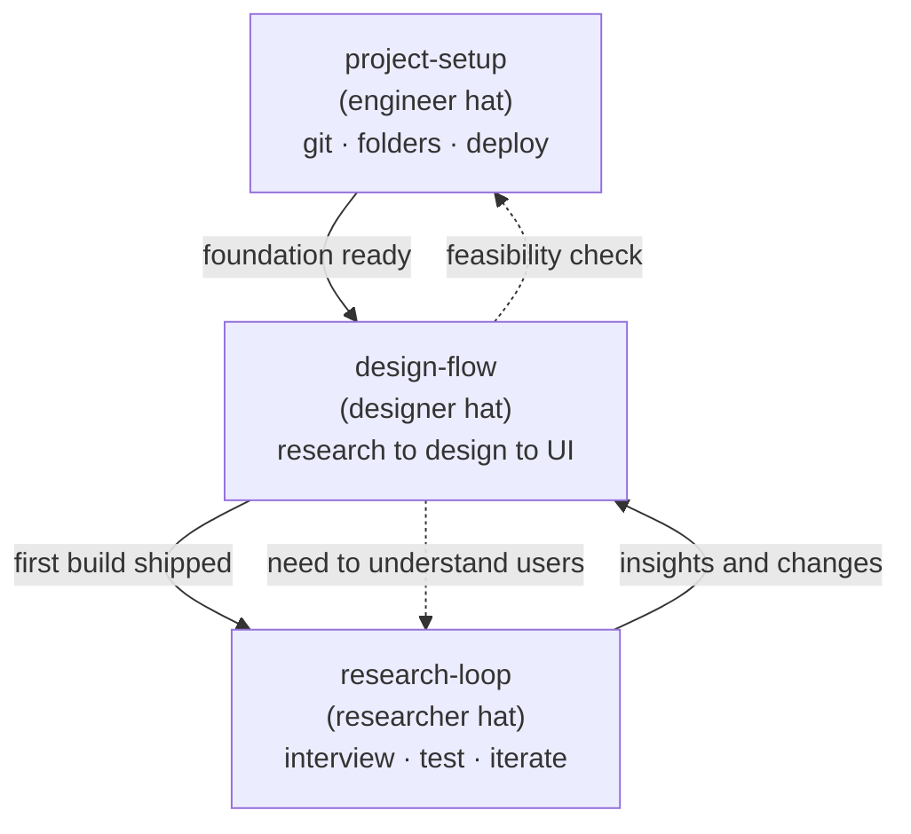

# Workflow & File-Structure Map (English)

A reference for how Dianne works with Claude: three skills covering a project end to
end, plus the file structure they produce. Share with engineers/teammates.

## The system: three skills, three hats, one loop

The skills are not rigid silos. They share explicit seams, and the agent (Claude)
holds all three and pulls in the right one at each moment — so nothing falls through.



## When to use each

| Skill | Trigger | You'd say |
|-------|---------|-----------|
| `project-setup` | starting a project / git / file structure / deploy | "set up a new project" |
| `design-flow` | designing a feature or a first build | "let's design this" |
| `research-loop` | (1) before design, to understand users; (2) after a build, to test and iterate | "let's do user research" |

## What each skill does

### project-setup (engineer hat)
- Look at the current state before acting
- Decide where git lives: new repo vs fork, public/private, account, monorepo vs single
- Fork an existing repo; set `origin` (yours) / `upstream` (source)
- Plan a folder-structure blueprint (plan first; don't build everything up front)
- Branch safely: working branches, preserve important work on named branches, when force-push is safe
- `.gitignore`: secrets (`.env`), `node_modules`, OS junk, personal drafts
- Small, clearly-described commits; push; open a PR
- Build-verify before deploying
- `README` (folder-level structure map + how to run + credits) + `docs/README` guide
- Local hygiene: `git status`, tracked vs untracked deletes, stage junk in `_to-delete/` before deleting
- Deploy (Vercel: link, root directory, build settings); custom domain / subdomain (DNS, CNAME)
- Seam: design work -> `design-flow`

### design-flow (designer hat) — step sequence
1. Discover — the problem; who and what
2. Research -> `research-loop`
3. Synthesize — insights, persona, jobs-to-be-done
4. Define success — what "good" looks like (success metrics)
5. Concept and direction — design principles
6. Scope — target devices and responsive range
7. Structure — UX flow + IA map + user journey map
8. UI design — wireframe -> visual -> components (design system, logo, references), including:
   - all states: empty, loading, error, no-results
   - UX writing / microcopy
   - accessibility (contrast, keyboard, screen reader, alt text)
9. Validate before build:
   - interactive prototype
   - critique on the HTML mockups -> `make-pages-interactive`
   - usability test -> `research-loop`
   - engineering feasibility -> `project-setup`
10. Handoff and document — specs, decision log
- Conventions throughout: `docs/` structure; file formats (`.html`/`.pdf`/`.md`);
  version archiving (`iterations/` + `CHANGELOG`); no emoji in docs; log the "why" in `decision-log`

### research-loop (researcher hat)
- Plan the study (goal, questions, method); recruit participants
- Generative research (before design): interviews, competitor analysis, desk research, surveys
- Evaluative research (after a build): usability testing, interviews on the real product
- Interview / test scripts; run sessions (facilitate, capture)
- Synthesize (affinity mapping, pain points, insights); prioritize what to iterate first
- Feed findings back -> `design-flow` / product iteration
- Iteration loop: build -> test -> learn -> prioritize -> back to design/build
- Archive outputs in `docs/01-research/` (+ `exports/` PDFs)
- Seams: design changes -> `design-flow`; comment on HTML -> `make-pages-interactive`

## How they connect (no gaps)
1. The agent holds all three and pulls in the right one — you don't have to pick perfectly.
2. Each skill names its seams: explicit "switch to skill X here" lines.
3. Shared `decision-log`; market skills (e.g. `make-pages-interactive`) plug into named steps.

## File structure

A repo has three parts: **thinking + product + front door.**

```
moodboard/
├── docs/                 THINKING — all research and design
│   ├── 01-research/        research, competitor analysis, insights
│   ├── 02-design/          design
│   │   ├── design-system/    visual language (logo/, references/, exports/)
│   │   └── ui/               latest wireframe + iterations/ + CHANGELOG
│   ├── 03-decisions/       why decisions were made
│   └── 04-casestudy/       case study (drafts kept local / gitignored)
├── reroom-frontend/      PRODUCT — the app (React + Vite)
├── roomgen-service/      backend (Java)
├── ProductCurator/       backend (Node)
└── README.md             FRONT DOOR — what it is, how to run, structure, credits
```

Principles:
- Number folders (`01`–`04`) so they sort in workflow order
- `.html` = working/editable, `.pdf` = shareable snapshot, `.md` = notes
- `.gitignore` is path-specific: secrets and local junk stay out; design assets inside `docs/` are kept
- Keep visible versions for design (`iterations/` + `CHANGELOG`); git history is the safety net
- README structure map stays folder-level (low maintenance); full detail in `docs/README`
