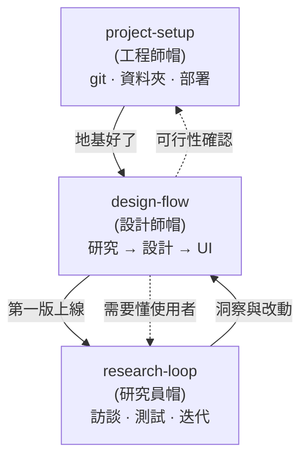

# 工作流程與檔案架構地圖（中文）

說明 Dianne 如何與 Claude 協作:用三個 skill 從頭到尾涵蓋一個專案,以及它們產生的檔案結構。可分享給工程師/隊友。

## 系統:三個 skill、三頂帽子、一個循環

這三個 skill 不是硬性切開的silos。它們之間有明確的「接縫」,而且 agent(Claude)同時握有三個、在每個時刻拉出對的那一個 —— 所以不會有東西掉縫裡。



## 什麼時候用哪一個

| Skill | 觸發時機 | 你會怎麼開口 |
|-------|---------|------------|
| `project-setup` | 開新專案 / git / 檔案結構 / 部署 | 「幫我開始一個新專案」 |
| `design-flow` | 要設計一個功能或第一版 | 「我們來設計這個」 |
| `research-loop` | (1) 設計前想懂使用者;(2) 建好後要測試+迭代 | 「我想做使用者研究」 |

## 每個 skill 會做的事

### project-setup（工程師帽）
- 動手前先看清楚現況
- 決定 git 放哪:開新 repo vs fork、公開/私人、哪個帳號、monorepo vs 單一
- fork 既有專案;設定 `origin`(你的)/ `upstream`(來源)
- 規劃資料夾結構藍圖(先有藍圖,不一次全建)
- 安全處理分支:工作分支、把重要工作存成獨立分支、什麼時候能安全 force-push
- `.gitignore`:密鑰(`.env`)、`node_modules`、系統垃圾、個人草稿
- commit 小而勤、訊息寫清楚;push;開 PR
- 上線前先 build 驗證
- `README`(資料夾層級結構圖 + 怎麼跑 + 致謝)+ `docs/README` 導覽
- 本機清理:`git status`、追蹤 vs 未追蹤的刪除差別、垃圾先移到 `_to-delete/` 再刪
- 部署(Vercel:連結、root directory、build 設定);自訂網域/子網域(DNS、CNAME)
- 接縫:遇到設計 -> `design-flow`

### design-flow（設計師帽）— 步驟順序
1. Discover 探索問題 — 要解決誰的什麼問題
2. Research 研究 -> `research-loop`
3. Synthesize 綜合洞察 — insights、persona、Jobs-to-be-Done
4. Define success 定義成功指標 — 怎樣算「做得好」
5. Concept 概念與方向 — 設計原則
6. Scope 範圍 — 目標裝置與響應式範圍
7. Structure 結構 — UX flow + IA 圖 + user journey map
8. UI design 介面設計 — wireframe -> 視覺 -> 元件(design system、logo、references),包含:
   - 所有狀態:空、載入中、錯誤、無結果
   - UX writing / 文案
   - 無障礙 a11y(對比、鍵盤、報讀、alt)
9. Validate 建造前驗證:
   - 互動原型
   - 在 HTML 稿上 critique -> `make-pages-interactive`
   - 可用性測試 -> `research-loop`
   - 工程可行性 -> `project-setup`
10. Handoff 交接與文件 — 規格、決策紀錄
- 全程慣例:`docs/` 結構;檔案格式(`.html`/`.pdf`/`.md`);版本封存(`iterations/` + `CHANGELOG`);docs 內無 emoji;把「為什麼」寫進 `decision-log`

### research-loop（研究員帽）
- 研究規劃(目標、要回答什麼問題、選方法);招募受訪者
- 探索式研究(設計前):訪談、競品分析、二手研究、問卷
- 評估式研究(建好後):可用性測試、對真實產品做使用者訪談
- 訪談 / 測試腳本;進行 session(引導、記錄)
- 綜合洞察(affinity mapping、痛點、洞察);排優先序(先迭代什麼)
- 把發現餵回 -> `design-flow` / 產品迭代
- 迭代循環:建好 -> 測試 -> 學到 -> 排序 -> 回到設計/建造
- 研究產出歸檔到 `docs/01-research/`(+ `exports/` PDF)
- 接縫:設計改動 -> `design-flow`;在 HTML 稿收意見 -> `make-pages-interactive`

## 它們怎麼連起來(不漏)
1. agent 同時握有三個、幫你拉出對的那一個 —— 你不用選得很準。
2. 每個 skill 都寫明接縫:明確的「在這裡切到某 skill」。
3. 共用 `decision-log`;市面上的 skill(例如 `make-pages-interactive`)接進指定的步驟。

## 檔案結構

一個 repo = 三塊:**思考 + 產品 + 門面。**

```
moodboard/
├── docs/                 思考 — 所有研究與設計
│   ├── 01-research/        研究、競品分析、洞察
│   ├── 02-design/          設計
│   │   ├── design-system/    視覺語言(logo/、references/、exports/)
│   │   └── ui/               最新 wireframe + iterations/ + CHANGELOG
│   ├── 03-decisions/       為什麼這樣決定
│   └── 04-casestudy/       案例研究(草稿留本機 / gitignore)
├── reroom-frontend/      產品 — app(React + Vite)
├── roomgen-service/      後端(Java)
├── ProductCurator/       後端(Node)
└── README.md             門面 — 這是什麼、怎麼跑、結構、致謝
```

原則:
- 資料夾編號(`01`–`04`)讓它們照流程順序排列
- `.html` = 工作/可編輯,`.pdf` = 可分享的快照,`.md` = 筆記
- `.gitignore` 看路徑:密鑰與本機垃圾擋在外;`docs/` 裡的設計資產保留
- 設計保留「看得見的版本」(`iterations/` + `CHANGELOG`);git 歷史是安全網
- README 結構圖維持資料夾層級(好維護);完整細節在 `docs/README`
